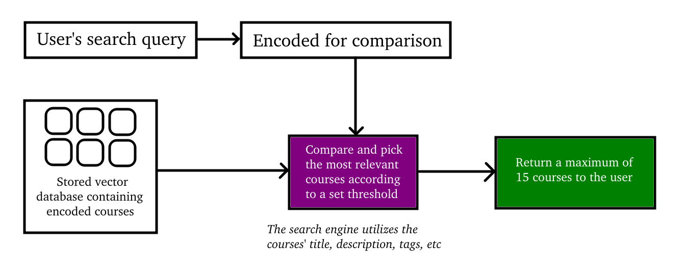

# CourseSeek – AI-Powered Course Search App
CourseSeek is a demo web application that lets users search for online courses using **natural language**.

It leverages **semantic embeddings** and **vector similarity** to provide smart, intuitive search results — even when keywords don't match exactly.

CourseSeek comes with a database of **100+ online tech courses**, ready for semantic search out of the box.

*I took only 3 days to finish this whole demo project.*

## Why This Project?
Recruiters and developers often face basic keyword match search. CourseSeek demonstrates how **semantic search** can improve UX by matching user *intent* — not just text.

Built as part of my AI/NLP portfolio to showcase:
- Real-world application of **embeddings**
- Use of **vector databases** or similarity search
- Clean **full-stack** architecture and UI

## Features
- Search using natural language (e.g., *"courses about neural networks for vision"*)
- Dynamically ranked course cards using embedding similarity
- Clean, responsive UI with hover animations

## Search Engine Architecture


1. All course titles, descriptions, and tags are embedded into vectors using a pretrained sentence transformer.
2. User queries are embedded and compared to each course using **cosine distance**.
3. The top-k most relevant courses are displayed in ranked order.

## Tech Stack
Frontend:
- React + TypeScript + Vite
- SCSS

Backend:
- FastAPI
- JSON DB

AI / NLP:
- SentenceTransformers
- Model: `sentence-transformers/all-mpnet-base-v2`

## Local Setup (Linux)
1. Run:
    ```bash
    git clone https://github.com/Mahmh/CourseSeek.git
    cd CourseSeek
    bash up.bash
    ```
2. Open `http://localhost:5173` in your browser to access the app.
3. Use the search bar to explore courses with semantic search.