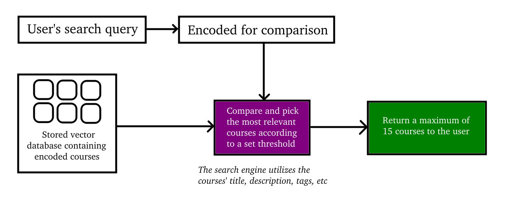

# CourseSeek – AI-Powered Course Search App


CourseSeek is a demo web application that lets users search for online courses using **natural language**.

It leverages **semantic embeddings** and **vector similarity** to provide smart, intuitive search results — even when keywords don't match exactly.

CourseSeek comes with a database of **100+ online tech courses**, ready for semantic search out of the box.

## Why This Project?
Recruiters and developers often face basic keyword match search. CourseSeek demonstrates how **semantic search** can improve UX by matching user *intent* — not just text.

Built as part of my AI/NLP portfolio to showcase:
- Real-world application of **embeddings**
- Use of **vector databases** or similarity search
- Clean **full-stack** architecture and UI

## Features
- Search using natural language (e.g., *"courses about neural networks for vision"*)
- Powered by sentence-transformer embeddings and cosine similarity to find the closest meaning, not just keyword matches.
- Dynamically ranked course cards using embedding similarity
- Clean, responsive UI with hover animations

## Search Engine Architecture


1. All course titles, descriptions, and tags are embedded into vectors using a pretrained sentence transformer.
2. User queries are embedded and compared to each course using **cosine distance**.
3. The top-k most relevant courses are displayed in ranked order.

## Demonstration
### Webpage Preview
This section showcases the initial layout of the semantic course search app, highlighting the clean UI and responsive design optimized for ease of use. It includes pagination for browsing through results cleanly.

<div style='display: flex; gap: 1rem;'>
  
  
</div>
<br>

### Searching for Courses
Below, you can see how the system responds to semantically different queries. Note how related topics are prioritized even when wording differs. Search results are returned within ~3 seconds, thanks to real-time semantic matching and ranking over all available courses.

<div style='display: flex; gap: 1rem;'>
  
  
</div>
<br>
<div style='display: flex; gap: 1rem;'>
  
  
</div>

## What I'd Do Next
This was built as a 3-day demo project, so I focused on simplicity and local performance. If I were to expand it further:
- Add user accounts with saved searches and favorites
- Deploy on Hugging Face Spaces, Vercel, or Render (if budget permits)
- Add caching or approximate nearest neighbor search to drop response times below 1s

## Tech Stack
Frontend:
- React + TypeScript + Vite
- SCSS

Backend:
- FastAPI
- JSON DB
- AI-generated course images

AI / NLP:
- SentenceTransformers
- Model: `sentence-transformers/all-mpnet-base-v2`

## Folder Structure
```py
src/
├── client/         # Frontend (React + Vite + TypeScript)
│   ├── src/        # Main source code for UI components and logic
│   ├── public/     # Static assets
│   ├── Dockerfile  # Frontend container build instructions
│   └── ...         # Other Vite/TS config and dependencies
└── server/         # Backend (FastAPI)
    ├── main.py     # Backend server entrypoint
    ├── lib/        # Core logic: embedding, search, utils, constants
    ├── data/       # Embedded course data or JSON & PNG database
    ├── Dockerfile  # Backend container build instructions
    └── requirements.txt  # Python dependencies
```

## Local Setup (Linux)
1. Run:
    ```bash
    git clone https://github.com/Mahmh/CourseSeek.git
    cd CourseSeek
    bash up.bash
    ```
2. Open `http://localhost:5173` in your browser to access the app.
3. Use the search bar to search freely using plain English.
4. When you are done testing this app, run this to clean up:
    ```bash
    bash down.bash
    ```